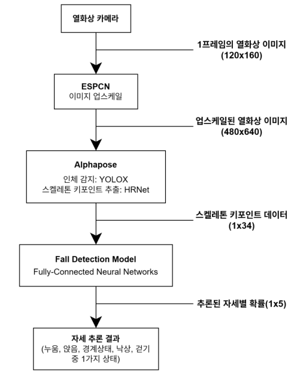
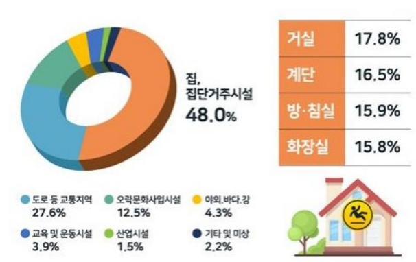

# 열화상 카메라를 이용한<br/> 1인 병실 환자 및 고령자 낙상 모니터링 시스템
## 1. 프로젝트 소개
- 프로젝트명 : 열화상 카메라를 이용한 1인 병실 환자 및 고령자 낙상 모니터링 시스템
- 프로젝트의 목적
    - 열화상 카메라를 이용해 사용자의 **프라이버시를** 지키며, 침대에서의 **현재 자세를 추론하는 딥러닝 모델**을 구성한다.
    - 실내에서의 **낙상 및 위험 요소를 모니터링** 하는 시스템을 만든다.
    - 저전력, 이동의 용이함, 저비용의 장점을 갖고 있는 **임베디드 보드**에서 시스템을 동작시킨다.
## 2. 팀 소개
### Team SafetyNet
김재현, jaeheyk@gmail.com, 임베디드 보드 포팅 및 모델 최적화  
권용휘, u_uhh08@naver.com, 데이터셋 제작 및 데이터 평가, 전처리  
신해운, shin87361@gmail.com, 딥러닝 모델 설계 및 실시간 비전 처리  
## 3. 시스템 구성도
  
이 과제는 3단계 시스템으로 구성되어 있습니다.  
1. ESPCN - [GitHub - leftthomas/ESPCN: A PyTorch implementation of ESPCN](https://github.com/leftthomas/ESPCN)
    
    입력으로 주어지는 열화상 이미지의 해상도는 120x160입니다. 이 해상도에서 모델의 인식률을 높이기 위해 x4 upscale 모델을 사용하여 해상도를 480x640으로 만듭니다.  
    ESPCN 모델을 사용하면 속도와 인식률 모두 뛰어난 성능을 확인할 수 있습니다.  
2. Alphapose - [GitHub - MVIG-SJTU/AlphaPose: Real-Time and Accurate Full-Body Multi-Person Pose Estimation](https://github.com/MVIG-SJTU/AlphaPose)
    
    열화상 이미지에서 사람을 인식하고 스켈레톤 데이터를 추출하는 Top-Down 기반 딥러닝 모델입니다.  
    사람의 위치를 감지하기 위해서 [YOLOX](https://github.com/Megvii-BaseDetection/YOLOX) Object-Detection 모델을 사용하며, 스켈레톤의 키포인트 데이터를 추출하기 위해 [HRNet](https://arxiv.org/abs/1908.07919) backbone을 사용합니다.
    
3. Fall Detection Model
    
    낙상 및 여러 자세를 인식하기 위한 데이터 분류 모델입니다. FCNNs(Fully-Connected Neural Networks) 기반으로 만들었습니다.  
    사전 학습된 모델로 top-view(위에서 내려다 본 자세), side-view(대상을 비스듬히 내려다 본 자세)의 모델을 제공합니다.

마지막 분류 모델에서 나온 label 중 확률이 가장 높은 자세를 추론 결과로 선정합니다. 추론 결과는 정확성을 높이기 위하여 버퍼 큐를 사용하여 최근 n개 (설정 가능) 중 가장 많은 자세를 결과로 반환합니다.

## 4. 소개 및 시연 영상

### 프로젝트 배경

여러분들은 **낙상사고**에 대해서 알고 계신가요?

낙상사고는 다양한 상황에서 넘어져서 발생하는 모든 사고를 의미합니다.

낙상사고로 인해 의식수준 저하, 뇌진탕 골절 등의 외상을 입기 쉬우며, 특히 노약자와 환자들에게 치명적입니다. 또한 그러한 사고는 집 안, 집 바깥 모두에서 발생하고 있습니다.



위 자료는 2021년 질병관리청에서 조사한 낙상 사고의 유형입니다. 대부분 안전하다고 생각하는 **집 안**에서 많이 발생하며, **침실과 방에서 일어난 낙상사고**가 가장 많습니다.

특히, 고령자의 낙상 사고는 치료 기간이 2주 ~ 4주 이상 길게 소요되는 경우가 많고 회복이 쉽지 않습니다.

저희는 이러한 배경을 바탕으로 **임베디드 시스템**을 사용한 **1인 병실과 고령자 1인 가구를 위한 낙상 모니터링 시스템**을 만들어, 낙상 위험성을 평가하고 빠르게 신고까지 연계될 수 있는 해결책을 제시하고자 합니다.

### 프로젝트 소개 동영상

### 프로젝트 시연 동영상
[](https://www.youtube.com/watch?v=ln7Ti9a9RgI)

## 5. 사용법

### Repository의 구성

- 폴더
    - AlphaPose
        - AlphaPose 모듈 및 실시간 낙상 감지 코드 (fall_detection_alphapose.py) 포함
        - /detector : 본 과제에서는 YOLOX 모델을 사용합니다.
        - /pretrained_models : ESPCN, HRNet 모델 및 pkl, Fall Detection Model의 사전 학습된 모델이 들어가는 폴더입니다.
        - fall_detection_alphapose.py : 실시간 낙상 감지 코드입니다. 아래 실행 방법을 참조하여 실시간 감지를 실행할 수 있습니다.
    - tensorflow_FCNNs
        - Tensorflow의 Keras를 사용해 만든 Fully-Connected Neural Networks 실험 자료입니다.
    - utils
        - image_preprocess.py : 열화상 이미지를 ESPCN으로 전처리하기 위한 코드입니다. 사용을 위해 코드 내부의 base_path(처리 전 이미지), save_path(처리 후 이미지 위치), model_path(ESPCN_x4.pb의 위치) 를 알맞게 조정하신 후 사용해주세요.
        - image_preprocess_random.py : 위 코드와 동일하지만, 이미지를 랜덤하게 picture_num개 추출해 전처리합니다.
        - resize_image.py : OpenCV의 resize 메서드로 전처리합니다.
- thermo_detector.py
    - yolov5_detector 폴더와 연계되며, YOLOv5 모델을 사용하여 바운딩 박스로 낙상 감지를 시도하는 실시간 처리 코드입니다.
    - 자세한 내용은 docs의 중간보고서 및 최종보고서를 참조해주세요.

**아래의 장비가 필요합니다.**

- ThermoCam160B  
리눅스 환경 하에서는 아래와 같이 uvcvideo 드라이버를 동적 로딩해야 합니다.  
    ```bash
    sudo rmmod uvcvideo
    sudo modprobe uvcvideo nodrop=1 timeout=5000
    ```

### AlphaPose 설치

자세한 내용은 [AlphaPose/INSTALL.md](https://github.com/MVIG-SJTU/AlphaPose/blob/master/docs/INSTALL.md)을 참고해주세요.

- CUDA가 설치된 컴퓨터가 필요합니다.
- Python 3.8+이 필요합니다.
- Cython이 설치되어 있어야 합니다.
- PyTorch 1.11+가 설치되어 있어야 합니다.
- torchvision 0.12.0+가 설치되어 있어야 합니다.
- numpy가 필요합니다.
- setuptools ≥ 40.0이 필요합니다.
- Linux 환경을 추천합니다. (Windows 환경에서 구동은 AlphaPose Repository를 확인해주세요.)

**Conda Installation**

```bash
# 1. Create a conda virtual environment.
conda create -n alphapose python=3.8 -y
conda activate alphapose

# 2. Install PyTorch, cudatoolkit은 자신의 버전에 맞게 설치해주세요.
conda install pytorch torchvision cudatoolkit=11.3 -c pytorch

# 4. install
export PATH=/usr/local/cuda/bin/:$PATH
export LD_LIBRARY_PATH=/usr/local/cuda/lib64/:$LD_LIBRARY_PATH
python -m pip install cython
sudo apt-get install libyaml-dev
################Only For Ubuntu 18.04#################
locale-gen C.UTF-8
# if locale-gen not found
sudo apt-get install locales
export LANG=C.UTF-8
######################################################
cd AlphaPose/
python setup.py build develop
```

**pip Installation**

```bash
# 1. Install PyTorch
pip3 install torch torchvision --extra-index-url https://download.pytorch.org/whl/cu113

# Check torch environment by:  python3 -m torch.utils.collect_env

# 3. install
export PATH=/usr/local/cuda/bin/:$PATH
export LD_LIBRARY_PATH=/usr/local/cuda/lib64/:$LD_LIBRARY_PATH
pip install cython
sudo apt-get install libyaml-dev
cd AlphaPose/
python3 setup.py build develop --user
```

### Nvidia Jetson AGX Xavier Developer Kit (16GB) 임베디드 보드에 설치  
1. Jetpack 5.0.2 설치([Nvidia SDK Manager](https://developer.nvidia.com/nvidia-sdk-manager) 이용)
2. Pytorch, torchvision, Tensorflow 설치  
    ```bash
    # Install prerequistes and dependencies
    sudo apt-get update
    sudo apt-get install libhdf5-serial-dev hdf5-tools libhdf5-dev zlib1g-dev zip libjpeg8-dev liblapack-dev libblas-dev gfortran libjpeg-dev libavcodec-dev libavformat-dev libswscale-dev

    # Install pytorch first 
    git clone https://github.com/pytorch/vision torchvision
    $ cd torchvision
    $ export BUILD_VERSION=0.x.0  # where 0.x.0 is the torchvision version  
    $ python3 setup.py install --user
    $ cd ../  # attempting to load torchvision from build dir will result in import error
    $ pip install 'pillow<7' # always needed for Python 2.7, not needed torchvision v0.5.0+ with Python 3.6
    sudo pip3 install --pre --extra-index-url https://developer.download.nvidia.com/compute/redist/jp/v50 tensorflow
    ```
3. OpenCV (with CUDA support)

    1. 기존 opencv 관련 파일을 모두 삭제
        ```bash
        sudo apt purge "*opencv*"
        sudo find / -name "*opencv*" -exec rm -i {} \;
        ```
    2. OpenCV와 contrib 모듈 소스를 모두 다운로드 받은 후 다음 cmake 명령어를 통해 makefile 생성.
        ```bash
        cmake -D CMAKE_BUILD_TYPE=RELEASE \
        -D CMAKE_INSTALL_PREFIX=/usr \
        -D OPENCV_EXTRA_MODULES_PATH=~/opencv_contrib/modules \
        -D EIGEN_INCLUDE_PATH=/usr/include/eigen3 \
        -D WITH_OPENCL=OFF \
        -D WITH_CUDA=ON \
        -D CUDA_ARCH_BIN=7.2 \
        -D CUDA_ARCH_PTX="" \
        -D WITH_CUDNN=ON \
        -D WITH_CUBLAS=ON \
        -D ENABLE_FAST_MATH=ON \
        -D CUDA_FAST_MATH=ON \
        -D OPENCV_DNN_CUDA=ON \
        -D ENABLE_NEON=ON \
        -D WITH_QT=OFF \
        -D WITH_OPENMP=ON \
        -D BUILD_TIFF=ON \
        -D WITH_FFMPEG=ON \
        -D WITH_GSTREAMER=ON \
        -D WITH_TBB=ON \
        -D BUILD_TBB=ON \
        -D BUILD_TESTS=OFF \
        -D WITH_EIGEN=ON \
        -D WITH_V4L=ON \
        -D WITH_LIBV4L=ON \
        -D OPENCV_ENABLE_NONFREE=ON \
        -D INSTALL_C_EXAMPLES=OFF \
        -D INSTALL_PYTHON_EXAMPLES=OFF \
        -D BUILD_opencv_python3=TRUE \
        -D OPENCV_GENERATE_PKGCONFIG=ON \
        -D BUILD_EXAMPLES=OFF ..
        ```
    3. 생성된 makefile을 통해 컴파일

### Models
- **사전 학습된 YOLOX 모델 넣기**  
    Download : [YOLOX-X model](https://drive.google.com/file/d/1F8HCZSnTdb0t_GkHxNYQ8CvIvL3HOT9d/view?usp=sharing) || [YOLOX-tiny model](https://drive.google.com/file/d/1MfrAEVnch-kIKqH7t-c3fuEmx2T8MT2H/view?usp=sharing)
    1. AlphaPose/yolox/ 폴더에 data 폴더를 생성합니다.
    2. 위 링크에서 모델을 다운받아 data 폴더에 넣습니다.
- **HRNet 모델 넣기**  
    [hrnet_w32_256x192.pth](https://drive.google.com/file/d/1i63BPlOnp2vSjIZ7ni4Yp3RCPQwqe922/view?usp=drive_open)  
    위 모델을 다운받아 AlphaPose/pretrained_models에 넣습니다.
- **Fall Detection Model**
  |  | pkl file | Model |
  | --- | --- | --- |
  | side-view | [download](https://drive.google.com/file/d/1UVhKj6sNPaAa7tgEmyKbVdPAHqMdRXKD/view?usp=sharing) | [download](https://drive.google.com/file/d/1_M9ovk9lQPk2YVj8qpq3Ebv94qb9XGQA/view?usp=sharing) |
  | top-view | [download](https://drive.google.com/file/d/1brB-kxT_2lOOcK8QvgoFhYHbHNS5H-Sd/view?usp=sharing) | [download](https://drive.google.com/file/d/12a3_t89JTEI5Pz2RgOPPeY0Nppe_s8mz/view?usp=sharing) |  
  
  위 파일들을 다운 받아, AlphaPose/pretrained_models에 넣습니다.

### 실행 방법

AlphaPose 폴더 안에서 다음과 같은 명령어로 실행할 수 있습니다.

```bash
# --detector에 원하는 yolox 모델 이름을 넣어주세요
# 사전 학습된 모델로 yolox-x, yolox-tiny 을 제공합니다.
python3 fall_detection_alphapose.py --detector yolox-x --cfg configs/coco/hrnet/256x192_w32_lr1e-3.yaml --checkpoint pretrained_models/hrnet_w32_256x192.pth --outdir examples/res --vis --webcam 0
```

- timeout 에러 발생시, 열화상 카메라의 연결에 문제가 발생한 경우가 대부분입니다. v4l2-ctl —list-devices 명령어를 사용해 /dev/video0에 연결되어 있는지 확인해주세요.
- 그 이외에 문제가 발생했을 시, shin87361@gmail.com 으로 문의 바랍니다.
